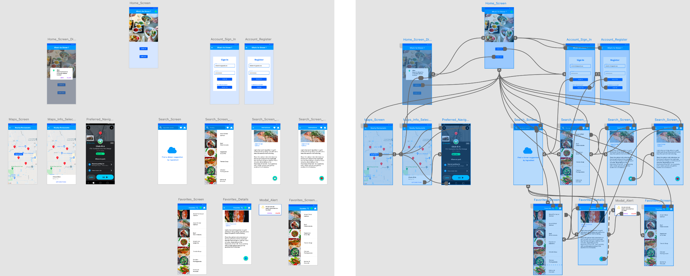
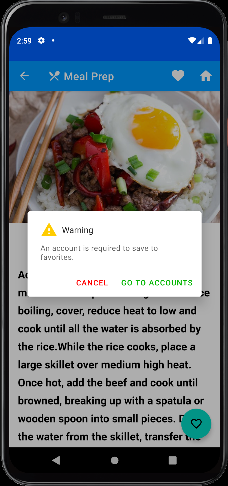
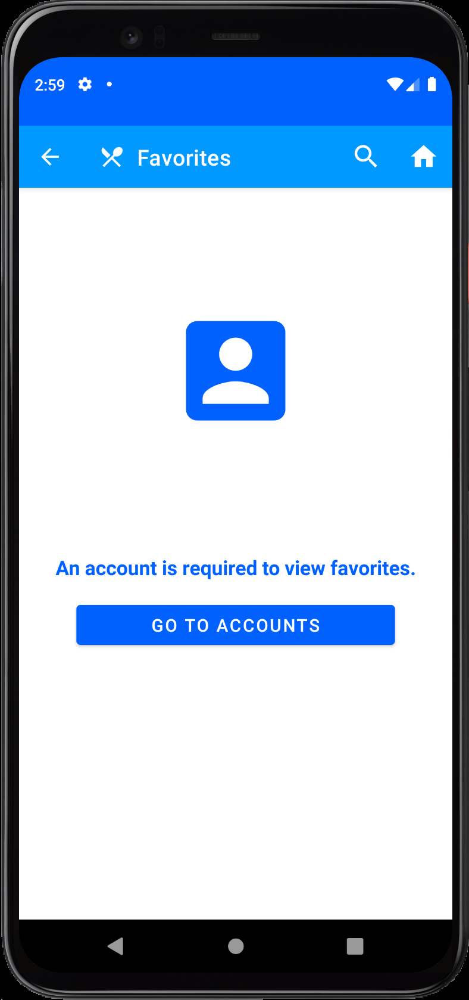

# Android Illustrations

_________________________________________________________________________

 
 

<h2 align="center">** Please allow a few minutes for GIFs to load **   Thank you so much</h3>

 
 

### Download Service

__Main concept__: Build an application that utilizes a Worker to download images on a background thread. Create a BroadcastReceiver to communicate to the main thread and update the UI with the newly downloaded images. Downsize the large images by converting them to bitmaps to prevent an out of memory exception.

Topics of research:

* Workers
* Broadcast Receivers
* Work Requests & Constraints
* Protected Storage
* IOUtils Library
* Bitmaps

  

### Home Screen Widgets

__Main concept__: Create a home screen widget that shows weather data. The data is updated every 30 minutes with the most current weather. If no internet connection is available, display the last known weather from a SQLite database. The widget should contain a configuration activity to change the weather location and widget theme. The widget will also display a weekly weather forecast when the widget's weather icon is pressed.

Topics of research

* Widgets
* App Widget Providers
* App Widget Managers
* Wiget Utilities

  
&nbsp;&nbsp;&nbsp;&nbsp;&nbsp;&nbsp&nbsp;&nbsp;&nbsp;&nbsp;&nbsp&nbsp&nbsp;&nbsp;

### Collection Widgets

__Main concept__: Build an application that shows images that are stored on the device. The application will also contain two widgets which show the images from the device in two different ways. The user should be able to select an image from either the app or the widgets to view the full size images in the built-in image viewer app.

Topics of research:

* Multiple Widgets
* Stack View Widgets
* Flipper View Widgets
* Accessing Media Store Images & Content URI's
* Decoding & Resizing Bitmaps

__Flipper View Widget__:

__Stack View Widget__:

  

## Portfolio Project Overview

App Name: __What's for Dinner__

 

__Main concepts__

* Provide dinner suggestions based on the user's search criteria.
* Provide cooking instructions and a favorites list.
* Provide up to 20 restaurant locations based on the user's GPS location.
* Provide directions to restaurants with Google Maps Navigation.

 

__Topics of Research__

* Google Firebase Firestore
* Google Maps SDK
* OkHttp Requests
* Spoonacular's Food-Recipe-Nutrition Database
* NearbyPlace's API
* Android Navigation: Top level navigation
* Android Bottom Sheet Dialog

 

### Prototype

  
&nbsp;&nbsp;&nbsp;&nbsp;&nbsp;&nbsp&nbsp;&nbsp;&nbsp;&nbsp;&nbsp&nbsp&nbsp;&nbsp;

 
 

  
&nbsp;&nbsp;&nbsp;&nbsp;&nbsp;&nbsp&nbsp;&nbsp;&nbsp;&nbsp;&nbsp&nbsp&nbsp;&nbsp;

 
 

  
&nbsp;&nbsp;&nbsp;&nbsp;&nbsp;&nbsp&nbsp;&nbsp;&nbsp;&nbsp;&nbsp&nbsp&nbsp;&nbsp;

 
 

  
&nbsp;&nbsp;&nbsp;&nbsp;&nbsp;&nbsp&nbsp;&nbsp;&nbsp;&nbsp;&nbsp&nbsp&nbsp;&nbsp;

 
 

  
&nbsp;&nbsp;&nbsp;&nbsp;&nbsp;&nbsp&nbsp;&nbsp;&nbsp;&nbsp;&nbsp&nbsp&nbsp;&nbsp;

### Android TV

__Main concepts__: Customize starter application, add custom data with rows and columns. Self research code explanation.

Topics of research:

* Card Presenter
* DetailsDescriptionPresenter
* BrowseSupportFragment
* GridItemPresenter
* ArrayObjectAdapter
* MovieLists

 
 

  

 
 

  

 
 

  

